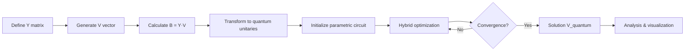

# Variational Power Flow Solver (VPFS) 🔋⚛️

> Solving power flow equations through variational quantum algorithms

[](https://www.python.org/)
[](https://pennylane.ai/)
[](https://www.xprize.org/)

---

## 🎯 What is this project?

This repository implements a **variational quantum solver** for the fundamental power flow problem in electrical systems: **Y·V = B**

- **Y**: Admittance matrix (represents the electrical grid topology)
- **V**: Complex voltage vector (what we want to find)
- **B**: Power injection vector (known)

Instead of classical methods (Newton-Raphson), we leverage **Variational Quantum Algorithms (VQA)** that exploit quantum superposition and hybrid
quantum-classical optimization to find solutions in scalable systems.

---

## ✨ Current Capabilities

### 🔬 Flexible Quantum Architecture

- **Scalable systems**: 2, 3, 4, and 5 qubits (→ 4, 8, 16, 32 buses)
- **Complex voltages**: Full support for Re(V) and Im(V) components
- **Multiple optimized ansätze**:
    - `complex_enhanced`: 3 params/qubit (efficient)
    - `dual_layer`: 4 params/qubit (2 rotation layers)
    - `hardware_efficient`: 4 params/qubit (real hardware-friendly)
    - `universal`: 9 params/qubit (maximum expressivity)
    - `brick_wall`: 4 params/qubit (alternating entanglement pattern)

### 🎛️ Advanced Optimization

- **Optimizers**: COBYLA, SGD, custom gradient descent
- **Adaptive learning rate** with convergence detection
- **Finite difference gradients** efficiently computed
- **Multi-seed experiments** for statistical robustness

### 🧮 Robust Mathematics

- Gram-Schmidt orthogonalization for unitary construction
- Matrix normalization and conditioning
- Polar decomposition and eigenvalue analysis
- Optimized matrix transformations

---

## 📁 Repository Structure

The code follows an **incremental evolution** pattern:

```
├── 1a_main_VPFS_real.py              # v1.0: Base implementation with Qiskit
├── 1b_main_VPFS_real_pennylane.py    # v1.1: PennyLane migration
├── 2_main_VPFS_vcomplejo.py          # v1.5: Complex voltages + improvements
├── 3_main_VPFS_2q.py                 # v1.5: 2-qubit optimized (4-bus system)
├── 4_main_VPFS_3q.py                 # v1.5: 3-qubit implementation (8-bus system)
└── 5_main_VPFS_4q.py                 # v1.5: N-qubit flexible architecture (16-bus) ⭐
```

**📌 Recommended file**: `5_main_VPFS_4q.py` contains the most recent and flexible implementation.

---

## 🚀 Quick Start

### Dependencies

```bash
pip install pennylane numpy scipy matplotlib
```

### Run the Solver

```python
python
5
_main_VPFS_4q.py
```

### Custom Configuration

Edit variables in the main script:

```python
# Quantum system
n_qubits = 4  # 2, 3, 4, or 5
n = 2 ** n_qubits  # System size (4, 8, 16, 32)

# Optimization
max_iterations = 500
learning_rate = 0.01
optimizer_choice = 'COBYLA'  # 'COBYLA', 'SGD', 'GD'

# Ansatz
ansatz_type = 'ansatz_complex_enhanced'
```

---

## 🔄 Algorithm Workflow



### Detailed Pipeline

1. **Matrix Preparation**:
    - Normalize Y → `Y_norm`
    - Extend to 2n×2n unitary → `Y_extended`
    - Construct `U_b_dagger` via Gram-Schmidt

2. **Quantum Circuits**:
    - **Circuit 1**: `Y_extended` applied to parametric state
    - **Circuit 2**: Circuit 1 + `U_b_dagger` application

3. **Loss Function**:
   ```
   Loss(θ) = ||Y·V_quantum(θ) - B||²
   ```

4. **Optimization**:
    - Adjust parameters θ to minimize Loss
    - Real-time convergence tracking

---

## 📊 Expected Results

The solver generates:

- **Convergence plots** (Loss vs Iterations)
- **Comparison**: `V_classical` vs `V_quantum`
- **Metrics**:
    - Absolute error: `||V_quantum - V_classical||`
    - Relative error: `||Error|| / ||V_classical||`
    - Convergence: Iterations to reach tolerance

**Example output**:

```
=== Quantum Solution ===
V_quantum: [0.9234-0.1256j, 0.8765+0.2341j, ...]
Relative error: 0.0043
Iterations: 287
```

---

## 🧪 Project Evolution

### Research Journey: Explored Approaches

This project represents an iterative research process where multiple quantum approaches were explored:

#### 🔬 **VQLS (Variational Quantum Linear Solver)**

- **Commit**: `cb37c0e` (Jun 28, 2025)
- **Approach**: Alternative quantum algorithm for solving linear systems
- **Outcome**: Tested for comparison with VPFS, provided insights into rectangular vs complex matrix representations
- **Files**: `VQLS_red_real.py` with results in JSON format

#### ⚛️ **Pauli Evolution Experiments**

- **Commit**: `e09534f` (Jul 3, 2025)
- **Approach**: Time evolution using Pauli operators (500+ lines)
- **Decision**: Removed in favor of simplified multi-seed experiments (300 lines)
- **Rationale**: More direct approach with better convergence characteristics

#### 📈 **Complex Voltage Breakthrough**

- **Commits**: `610f4b4`, `18f98a1`, `b1b4bd1` (Jun-Jul 2025)
- **Evolution**: Real voltages → Complex voltages
- **Impact**: Enabled realistic power system modeling with phase angles
- **Key milestone**: Transition from simplified to production-ready solver

### Major Milestones (Git History)

| Commit    | Date   | Description                     | Impact                               |
|-----------|--------|---------------------------------|--------------------------------------|
| `f0f3f38` | Jul 22 | 4-qubit version                 | 🎉 16-bus system capability          |
| `d952892` | Jul 22 | Corrected 2-qubit file          | 🔧 Bug fix in parameter handling     |
| `b1b4bd1` | Jul 7  | Promising complex V experiments | 🔬 Complex voltage validation        |
| `60e53c4` | Jul 7  | Fixed plotting error            | 📊 Visualization improvements        |
| `e09534f` | Jul 3  | Removed Pauli evolution         | 🎯 Simplified approach               |
| `610f4b4` | Jun 27 | VPFS with fully complex Y       | ✅ Good solution achieved             |
| `9b1c407` | Jun 27 | Improved VPFS                   | 🚀 Core optimizations + JSON results |
| `7cfa936` | Jun 21 | Ansatz/optimizer flexibility    | ⚙️ Modular architecture              |
| `cb37c0e` | Jun 21 | VQLS comparison                 | 🔬 Rectangular vs complex forms      |

### Version History

- **v1.0**: Base implementation (Qiskit framework)
- **v1.1**: VPFS with PennyLane migration
- **v1.2**: Enhanced ansatz architectures
- **v1.3**: Architecture refactoring
- **v1.4**: Analytical gradient calculations
- **v1.5**: **Complex voltage support** (current version) ✅

See [`VERSIONS.md`](VERSIONS.md) for complete details.

---

## 🧠 Theoretical Foundations

### Why Quantum Computing?

Power flow problems in large grids (hundreds of buses) require:

- Solving complex nonlinear systems
- Expensive matrix operations O(n³)
- Convergence in challenging scenarios

**VQA offers**:

- Parallel solution space exploration (superposition)
- Potential scalability O(poly(n)) on quantum hardware
- Resistance to local minima (quantum landscape)

### Current Limitations

⚠️ **This is a proof-of-concept experiment**:

- Classical simulators (not yet on real quantum hardware)
- Limited to small systems (≤16 buses in simulation)
- Convergence depends on initialization and ansatz choice
- Does not always outperform classical methods on simulators

### Future Applications

With real quantum hardware:

- 🏙️ **Smart Grids**: Real-time microgrid optimization
- ⚡ **Energy Management**: Supply-demand balancing with renewables
- 🔌 **Network Planning**: Optimal topology design
- 🌍 **Large-scale systems**: Continental power grid optimization

---

## 🛠️ Technology Stack

| Technology      | Purpose                                     |
|-----------------|---------------------------------------------|
| **PennyLane**   | Primary quantum computing framework         |
| **NumPy**       | Linear algebra and matrix operations        |
| **SciPy**       | Optimization (`minimize`, `sqrtm`, `polar`) |
| **Matplotlib**  | Results visualization                       |
| **Python 3.8+** | Core language                               |

---

## 📚 Relevant References

1. **Variational Quantum Algorithms**: Cerezo et al., *Nature Reviews Physics* (2021)
2. **VQLS**: Bravo-Prieto et al., *Quantum* 4, 291 (2020)
3. **Power Flow Problem**: Grainger & Stevenson, *Power System Analysis*
4. **PennyLane**: Bergholm et al., arXiv:1811.04968

---

## 🔍 Research Highlights

### What Makes This Work Unique?

1. **Hybrid Approach**: Combines classical power systems knowledge with quantum optimization
2. **Practical Focus**: Real-world admittance matrices and complex voltages
3. **Experimental Rigor**: Multi-seed experiments, statistical validation, JSON result tracking
4. **Open Exploration**: Documents both successful and abandoned approaches (VQLS, Pauli evolution)

### Key Insights Gained

- ✅ Complex voltage encoding is essential for realistic power systems
- ✅ Simpler ansätze often outperform complex ones (overfitting in small systems)
- ✅ Multi-seed experiments reveal optimizer sensitivity
- ✅ Matrix conditioning critically affects convergence
- ⚠️ Pauli evolution approaches added complexity without clear benefits
- ⚠️ VQLS and VPFS have different convergence characteristics for power flow

---